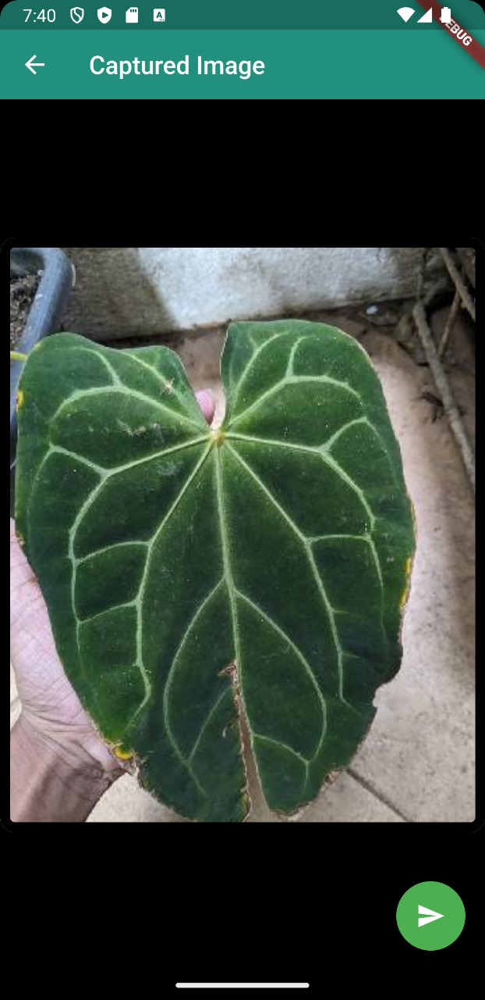
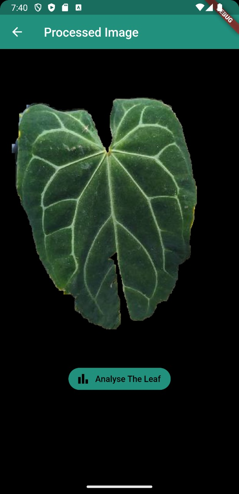

[comment]: # "This is the standard layout for the project, but you can clean this and use your own template"

# A Field-Based Approach for Quantifying Plant Leaf Color

  

---

<!--
This is a sample image, to show how to add images to your page. To learn more options, please refer [this](https://projects.ce.pdn.ac.lk/docs/faq/how-to-add-an-image/)

 -->

## Team

- [E/19/094, Eashwara M.](https://people.ce.pdn.ac.lk/students/e19/094/)
- [E/19/129, Gunawardana K.H.](https://people.ce.pdn.ac.lk/students/e19/129/)
- [E/19/372, Silva A.K.M.](https://people.ce.pdn.ac.lk/students/e19/372/)
- [E/19/408, Ubayasiri S.J.](https://people.ce.pdn.ac.lk/students/e19/408/)

## Table of Contents

1. [Introduction](#introduction)
2. [Challenges With Traditional Method](#challenges-with-traditional-method)
3. [Our Solution](#our-solution)
4. [Key Features](#key-features)
5. [Tech Stack](#tech-stack)
6. [Leaf Segmentation Techniques](#leaf-segmentation-techniques)
7. [Dominant Color Extractions](#dominant-color-extraction)
8. [Report Generation](#report-generation)
9. [Links](#links)

---

## Introduction

Welcome to <em>"LeafSpectrum"</em>, a cutting-edge mobile application designed to revolutionize the way we perceive and understand the world of plants. LeafSpectrum is your trusted companion in the realm of leaf color analysis, offering a seamless and elegant solution for plant enthusiasts, researchers, and botanists alike.

## Challenges With Traditional Method

Traditional methods of leaf color assessment have long relied on subjective human judgment and manual color matching, resulting in inconsistencies and subjectivity in scientific studies and plant identification.
<em>LeafSpectrum</em> addresses this critical need for a reliable, objective, and time-efficient leaf color assessment technique.

  

## Our Solution

<em>LeafSpectrum</em> introduces an innovative approach that combines digital imaging with advanced image processing techniques to objectively quantify leaf color. With the convenience of widely available equipment such as smartphones or digital cameras, users can capture high-resolution leaf images effortlessly. Behind the scenes, sophisticated image processing algorithms extract and analyze color information, eliminating the subjectivity of the manual color assessment.

## Key Features

- **Home Page**  
  Simple and easy-to-navigate homepage where you can effortlessly capture leaf images or import them from your gallery.

  

<!-- -->

- **Selected Image**  
  The selected image before processing

  

<!--  -->

- **Image Segmentation**  
  When you capture a leaf image or import one from your gallery, the segmentation algorithm goes to work. It carefully identifies and separates the leaf from its surroundings, effectively isolating it.

  

- **Manual Masking**  
  If the image was not segmented properly user can navigate to manually improve the selection by painting over it

  
  

<!--  -->

- **Color Analysis**

Channel separated histograms and pie charts in LeafSpectrum generates a graphical representation of the leaf's color distribution. It displays how various color values are distributed across the leaf image, enabling users to precisely quantify and understand its color characteristics. Also it has the ability to selectively refine the histogram based on individual color channels, namely Red, Green, and Blue.

  
   

<!--   -->

<!--
<ul>
 <li> <strong>Home Page</strong>  
Simple and easy-to-navigate homepage where you can effortlessly capture leaf images or import them from your gallery. 

    </li>

 <li><strong>Image Segmentation</strong> 
When you capture a leaf image or import one from your gallery, the segmentation algorithm goes to work. It carefully identifies and separates the leaf from its surroundings, effectively isolating it. 

 </li>

 <li><strong>Color Analysis</strong> 
 The histogram feature in LeafSpectrum generates a graphical representation of the leaf's color distribution. It displays how various color values are distributed across the leaf image, enabling users to precisely quantify and understand its color characteristics. 

 </li>
</ul>
-->

## Tech Stack

  

## Leaf Segmentation Techniques

In the Leaf Colour Quantifier project, we employ three different leaf segmentation techniques to accurately isolate plant leaves from images.

### 1. OpenCV Algorithm

The OpenCV-based leaf segmentation algorithm utilizes various image processing methods to generate a marker for identifying the leaf region within an image.

- **Generate Background Marker**: A background marker is created to distinguish the leaf from the background. This marker is updated using techniques such as color index markers and removing blues. The details of the background marker generation process include:

  - **Color Index Marker**: The marker is differentiated based on the difference of color indexes, specifically the green index minus the red index.
  - **Thresholding**: A threshold is applied to the color index difference to separate the leaf from the background. The threshold value is chosen empirically based on testing.
  - **Hole Filling**: Holes in the marker, which may appear due to thresholding, can be filled using various techniques:
    - **Floodfill**: Floodfilling is used to fill holes, and a mask is created to avoid filling non-hole regions adjacent to the image edge.
    - **Threshold-Based**: Holes are filled based on a minimum hole size threshold, often relative to the size of the largest leaf component.

- **Segment Leaf**: The leaf is segmented from the original image using the generated background marker. The segmentation includes options for filling holes, smoothing boundaries, and specifying marker intensity.

  
  

This technique is implemented in Python and provides an efficient way to segment leaves from images.

### 2. Mask R-CNN Model

The Mask R-CNN model is a deep learning-based technique used for leaf segmentation. It leverages pre-trained models and fine-tunes them for the task of identifying leaves in images.

**Note: Initially, this model works specifically for the "Dieffenbachia Amoena" species. However, we plan to extend its functionality to other plant species as well.**

  

- **Data Augmentation**: The code applies various data augmentation techniques to enhance the diversity of the training dataset. These techniques include rotations, resizing, blurring, sharpening, and more. Data augmentation helps the model generalize better to different leaf images.

- **Dataset Preparation**: The code loads leaf images and corresponding masks, where each pixel in the mask corresponds to a specific object (in this case, different parts of the plant leaf). It prepares the data by resizing and applying data augmentation.

- **Model Architecture**: It uses the Mask R-CNN architecture based on ResNet-50 as the backbone. The model is customized for binary leaf segmentation (foreground and background). Fast R-CNN and Mask R-CNN predictors are modified accordingly.

  

- **Training Loop**: The code includes a training loop that iterates over the dataset. It uses stochastic gradient descent (SGD) as the optimizer and calculates the loss for each batch. The loss is backpropagated to update the model's weights.

- **Validation**: After each epoch of training, the code evaluates the model on a validation dataset to monitor its performance.

- **Model Saving**: The trained model is saved to a file for later use in the Leaf Colour Quantifier project.

  
  

The trained Mask R-CNN model provides accurate leaf segmentation results and is a powerful tool for this task.

### 3. Mask-Based Segmentation

This technique combines mask-based segmentation with color filtering to isolate leaves in images. Here's how it works:

- **Create Composite Mask**: A composite mask is created by performing bitwise AND operations between a binary paint mask and a leaf mask obtained from the photo image.

- **Extract Leaf Mask**: The leaf mask is extracted by converting the image to grayscale, applying thresholding, and finding the contour with the maximum area.

- **Filter Color**: Color filtering is applied to the mask to remove non-leaf regions, leaving only the segmented leaf.

This technique effectively combines mask-based and color-based segmentation to accurately identify plant leaves.

## Dominant Color Extraction

The dominant color extraction process involves identifying the main colors in an image. It's particularly useful for analyzing the predominant color characteristics of plant leaves or other plant parts.

  

1. **Convert to RGB**: The input image is first converted from the BGR color space to the more commonly used RGB color space. This step ensures that the image is in the right color format for further processing.

2. **Flatten Image**: The image is then flattened into a 2D array of pixels. Each pixel is represented by its RGB values.

3. **K-Means Clustering**: K-means clustering is applied to the flattened pixel data. The algorithm groups similar colors together into clusters, with each cluster representing a dominant color. The number of clusters (colors) to extract can be specified as a parameter (default is 3).

4. **Cluster Analysis**: After clustering, we obtain the labels and counts for each cluster. The clusters are sorted based on the count of pixels they contain in descending order, revealing the most dominant colors.

5. **Top Dominant Colors**: The top 3 clusters (where 3 is the specified number of dominant colors) are selected based on their pixel count. These clusters represent the dominant colors in the image.

6. **Color Percentage**: We calculate the percentage of each dominant color in the image by dividing the count of pixels in each cluster by the total number of pixels in the image.

7. **Color Spread**: The color spread is calculated to determine how spread out the colors are within each cluster. It provides insights into the variability of each dominant color.

### Output

The output of this process includes:

- The RGB values of the dominant colors.
- The percentage of each dominant color in the image.
- The color spread (variability) of each dominant color.

## Report Generation

The report generation process aims to provide a detailed summary of the image analysis, making it easier for users to understand the results and observations. The report is created in PDF format and contains various sections with visual representations of the analysis.

1. **Histogram Generation**: Histograms of color channels (Red, Green, Blue) are generated from the segmented leaf image. These histograms provide insights into the distribution of pixel intensities for each color channel.

2. **PDF Creation**: The ReportLab library is used to create a PDF document. We set up the document's layout, fonts, and styles for consistent formatting.

3. **Header Information**: The report begins with a title, "Leaf Spectrum Report," followed by the date and time of the analysis. The current date and time are automatically generated using the `datetime` module.

4. **Image and Logo**: The original plant image is resized and included in the report to provide visual context. Additionally, a logo image is added for branding purposes.

5. **Histogram Section**: The histograms of color channels (Red, Green, Blue) are added to the report, providing a visual representation of color distribution within the segmented leaf.

6. **Remarks**: Users have the option to add remarks or comments to the report. These remarks are included in the report for additional information.

---

## Links

- [Department of Computer Engineering](http://www.ce.pdn.ac.lk/)
- [University of Peradeniya](https://eng.pdn.ac.lk/)

[//]: # "Please refer this to learn more about Markdown syntax"
[//]: # "https://github.com/adam-p/markdown-here/wiki/Markdown-Cheatsheet"
